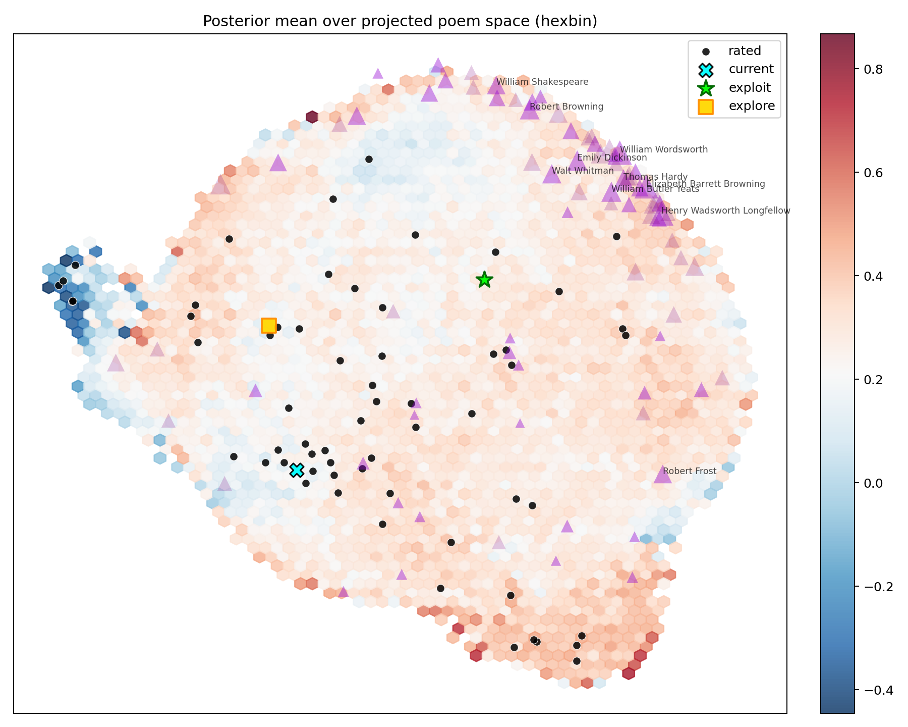

# Poetry GP: Learning Preference
### Gaussian Processes, Active Learning, and HPC

**Goal**: Learn reader's taste, recommend poems strategically

- 85,000 poems → 384-dim embeddings
- User rates poems → Infer preference function
- Balance **exploit** (recommend favorites) vs **explore** (ask questions)

**HPC Challenge**: Exact GP scales as $O(m^3)$ fit, $O(nm^2)$ scoring

---

# Problem Motivation

**Authentic ML application**:

- High-dimensional data ($d = 384$)
- Large candidate pool ($n = 85{,}000$)
- Interactive learning (ratings accumulate)
- Uncertainty quantification (know confidence)

**Computational bottlenecks**:

- **Fit**: $O(m^3)$ Cholesky factorization
- **Score**: $O(nm^2)$ variance computation
- Real performance challenges motivate HPC solutions

**Pedagogical value**: Theory meets practice

---

# The Learning Loop

```
Rate poem → Update posterior → Score candidates → Choose next poem
  (input)     (O(m³) fit)         (O(nm²) score)    (acquisition)
```

**Given**:

- Rated: $\{(x_i, y_i)\}_{i=1}^m$ where $x_i \in \mathbb{R}^{384}$
- Candidates: $\{x_j\}_{j=1}^{85000}$

**Compute**:

- Posterior mean $\mu(x)$ (expected preference)
- Posterior variance $\sigma^2(x)$ (uncertainty)

---

# Ridge Regression = Bayesian Linear Regression

**Linear model**:
$$y = X\beta + \varepsilon, \qquad \varepsilon \sim \mathcal{N}(0, \sigma_n^2 I)$$

**Gaussian prior** (ridge penalty):
$$\beta \sim \mathcal{N}(0, \lambda^{-1} I)$$

**MAP estimate**:
$$\hat{\beta} = (X^\top X + \lambda I_p)^{-1} X^\top y$$

**Prediction**:
$$\hat{y}_* = x_*^\top \hat{\beta}$$

**Interpretation**: Ridge shrinkage = Bayesian prior

---

# Dual Problem: Primal vs Dual

**Primal form** ($p \times p$ system):
$$\hat{y}_* = x_*^\top (X^\top X + \lambda I_p)^{-1} X^\top y$$

**Dual form** ($m \times m$ system):
$$\hat{y}_* = x_*^\top X^\top (X X^\top + \lambda I_m)^{-1} y$$

Define Gram matrix $K = XX^\top$ and $k_* = Xx_*$:
$$\hat{y}_* = k_*^\top (K + \lambda I)^{-1} y$$

**Key insight**: All predictions use inner products $K_{ij} = x_i^\top x_j$

**When $m < p$**: Dual is cheaper

**Replace linear kernel with RBF**: $k(x,x') = \sigma_f^2 \exp(-\|x-x'\|^2/2\ell^2)$

---

# Gaussian Process Prior

**GP as multivariate Gaussian over function values**:

For two points $x_1, x_2$:
$$\begin{bmatrix} f_1 \\ f_2 \end{bmatrix} \sim \mathcal{N}\left(
\begin{bmatrix} 0 \\ 0 \end{bmatrix},
\begin{bmatrix}
k(x_1,x_1) & k(x_1,x_2) \\
k(x_2,x_1) & k(x_2,x_2)
\end{bmatrix}
\right)$$

**Generalize to $m$ rated points**:
$$f_r \sim \mathcal{N}(0, K_{rr})$$

where $(K_{rr})_{ij} = k(x_i, x_j)$

**Key idea**: Kernel defines covariance between function values

---

# 1D GP Example

{width=70%}

**Observations**: Sparse rated points (red dots)

**Posterior**: Mean $\mu(x)$ (blue line), uncertainty $\pm 2\sigma(x)$ (shaded)

**Uncertainty shrinks** near observations, **grows** in unexplored regions

---

# GP Posterior Update

**Joint distribution** (rated + new point):
$$\begin{bmatrix} y_r \\ f_* \end{bmatrix} \sim \mathcal{N}\left(
\begin{bmatrix} 0 \\ 0 \end{bmatrix},
\begin{bmatrix}
K_{rr} + \sigma_n^2 I & k_{r*} \\
k_{*r} & k_{**}
\end{bmatrix}
\right)$$

**Posterior mean**:
$$\mu(x_*) = k_{*r}^\top (K_{rr} + \sigma_n^2 I)^{-1} y_r$$

**Posterior variance**:
$$\sigma^2(x_*) = k(x_*, x_*) - k_{*r}^\top (K_{rr} + \sigma_n^2 I)^{-1} k_{r*}$$

**This is what we need to compute**

---

# Computational Bottleneck: Fit

**What we compute** (define $K = K_{rr} + \sigma_n^2 I$):

1. **Cholesky factorization**: $K = LL^\top$
2. **Solve for weights**: $\alpha = K^{-1} y$

**Complexity**:

- Kernel assembly: $O(m^2 d)$
- **Cholesky**: $O(m^3)$ ← **bottleneck**
- Solve: $O(m^2)$

**Scaling variable**: $m$ = rated poems

**As $m$ grows**: Cubic scaling!

---

# Computational Bottleneck: Scoring

**For $n$ candidates**, compute:

**Posterior mean** (efficient):
$$\mu_q = K_{qr} \alpha \qquad \text{Cost: } O(nmd + nm)$$

**Posterior variance** (expensive):
$$\sigma^2_q = \text{diag}(K_{qq}) - \text{diag}(K_{qr} K^{-1} K_{rq})$$

Rewrite as $v = L^{-1} K_{rq}$:
$$\sigma^2_q = \text{diag}(K_{qq}) - \text{diag}(v^\top v)$$

**Cost**: $O(nm^2)$ ← **bottleneck for exploration**

**Key variables**: $n = 85{,}000$ candidates, $m$ = rated poems

---

# Time Breakdown: Fit vs Score

{width=70%}

**Fit dominates** for large $m$ (cubic scaling), **score dominates** for large $n$ with variance

---

# Hyperparameter Optimization

**Kernel hyperparameters**: $\theta = (\ell, \sigma_f, \sigma_n)$

- Length scale $\ell$: How far correlations extend
- Signal variance $\sigma_f^2$: Prior belief about rating scale
- Noise $\sigma_n^2$: Measurement noise

**Optimization**: Maximize marginal likelihood
$$\log p(y \mid X, \theta) = -\frac{1}{2} y^\top K^{-1} y - \frac{1}{2} \log|K| - \frac{m}{2}\log(2\pi)$$

**Method**: L-BFGS with analytic gradients

**Cost**: $O(m^3)$ per evaluation (same as fit)

**When**: Before interactive session or periodically during use

---

# Active Learning: Acquisition Functions

**Exploitation** (recommend favorites):

- max_mean: $\arg\max \mu(x)$ — greedy, fast ($O(nm)$)
- UCB: $\arg\max [\mu(x) + \beta \sigma(x)]$ — balance ($O(nm^2)$)
- thompson: Sample $f \sim \mathcal{N}(\mu, \Sigma)$ — Bayesian ($O(nm^2)$)

**Exploration** (ask informative questions):

- max_variance: $\arg\max \sigma^2(x)$ — information-optimal ($O(nm^2)$)
- expected_improvement: Classic BO ($O(nm^2)$)
- spatial_variance: Spatially diverse ($O(n^2)$, slow)

**Computational tradeoff**: Exploration requires variance → $O(nm^2)$

---

# Implementation: Backend Abstraction

```python
result = run_blocked_step(
    embeddings, rated_indices, ratings,
    fit_backend="auto",      # python, native_lapack, scalapack
    score_backend="auto",    # python, native_lapack, gpu
)
```

**Fit backends** ($O(m^3)$):

- python: NumPy/SciPy (baseline)
- native_lapack: PyBind11 + LAPACK (zero overhead)
- scalapack: MPI distributed (block-cyclic layout)

**Score backends** ($O(nm^2)$):

- python: NumPy + BLAS
- native_lapack: Multi-threaded BLAS
- gpu: CuPy/CUDA

---

# Fit Backend: Python

```python
K = rbf_kernel(X_rated) + noise * np.eye(m)
L = scipy.linalg.cholesky(K, lower=True)
alpha = scipy.linalg.cho_solve((L, True), y)
```

**Characteristics**:

- Pure Python + NumPy
- ~5ms overhead (Python calls, allocations)

**When to use**: Small problems ($m < 5{,}000$), prototyping

---

# Fit Backend: PyBind11 + LAPACK

```cpp
// Direct LAPACK, no Python overhead
dpotrf_(&uplo, &m, K.data(), &m, &info);  // Cholesky
dtrsv_(...);  // Triangular solve
```

**Characteristics**:

- Eliminate Python overhead
- Shared memory (single node)
- ~0.1ms overhead (nearly zero)

**When to use**: $m < 5{,}000$, single-node sufficient

---

# Fit Backend: ScaLAPACK (Distributed)

**Process grid** ($P \times Q$):

```
2x2 grid:
+-----+-----+
| P00 | P01 |
+-----+-----+
| P10 | P11 |
+-----+-----+
```

**Block-cyclic distribution** (block size $b$):

- Matrix divided into $b \times b$ blocks
- Distributed across processes in cyclic pattern
- Enables parallel Cholesky factorization

**Key optimization** (Milestone 1B): Broadcast features (~30MB) instead of scatter matrix (~800MB) → 20-40× assembly speedup

---

# Benchmark: Fit Scaling (Actual Data)

**Python (SciPy) vs ScaLAPACK** (varying processes):

| $m$ | Python | ScaLAPACK (1 proc) | ScaLAPACK (4 proc) | ScaLAPACK (8 proc) | ScaLAPACK (16 proc) |
|-----|--------|--------------------|--------------------|--------------------|--------------------|
| 2,000 | 0.18s | 0.77s | 0.64s | 0.69s | 0.86s |
| 7,000 | 3.24s | 5.51s | 2.13s | **1.58s** | 1.83s |
| 15,000 | 22.51s | 38.00s | 12.66s | **5.52s** | 7.03s |
| 20,000 | 49.57s | 84.79s | 27.44s | **11.56s** | 14.88s |

**Key findings**:

- Crossover: $m \approx 5{,}000 - 7{,}000$
- Best: 8 processes (4.3× faster at $m=20{,}000$)
- 16 processes: Diminishing returns (overhead)

---

# Benchmark: Fit Scaling (Visual)

{width=70%}

**Observations**: Python fast for small $m$, ScaLAPACK wins at large $m$, 8 processes optimal

---

# Benchmark: ScaLAPACK Speedup

**Speedup vs Python** (ScaLAPACK with 8 processes):

| $m$ | Python time | ScaLAPACK time | Speedup |
|-----|-------------|----------------|---------|
| 2,000 | 0.18s | 0.69s | **0.26×** (slower!) |
| 5,000 | 1.45s | 1.12s | 1.3× |
| 7,000 | 3.24s | 1.58s | 2.1× |
| 10,000 | 8.00s | 2.59s | 3.1× |
| 15,000 | 22.51s | 5.52s | 4.1× |
| 20,000 | 49.57s | 11.56s | **4.3×** |

**Observation**: Overhead dominates for $m < 5{,}000$, then compute wins

---

# Benchmark: Speedup (Visual)

{width=70%}

**Crossover at $m \approx 5{,}000$**: Below = overhead dominates, above = parallelism wins

---

# Benchmark: Why 16 Processes Slower?

**ScaLAPACK at $m = 20{,}000$**:

- 1 process: 84.79s (sequential overhead)
- 4 processes: 27.44s
- 8 processes: **11.56s** (best)
- 16 processes: 14.88s (worse than 8!)

**Interpretation**:

- Communication overhead grows with process count
- Problem size not large enough for 16 processes
- Amdahl's law: Fixed overhead limits speedup

**Lesson**: More processes $\neq$ better performance

---

# Benchmark: Process Scaling (Visual)

{width=70%}

**Amdahl's law in action**: 8 processes optimal, 16 shows diminishing returns

---

# War Stories: What Worked

**[WORKS] Distributed kernel assembly**:

- Broadcast features (30MB), not matrix (800MB)
- 20-40× assembly speedup

**[WORKS] PyBind11 for single-node**:

- Eliminate Python overhead
- Best for $m < 5{,}000$

**[WORKS] Lazy variance evaluation**:

- Skip $O(nm^2)$ when not needed
- max_mean is 85× faster than max_variance

---

# War Stories: What Didn't Work (At First)

**[FAILED] ScaLAPACK performance mystery**:

- Pedagogical benchmarks 21-146× slower than expected
- Root cause: Missing `OMP_NUM_THREADS=1` (BLAS threading conflict)
- Root cause: Wrong MPI launcher (`srun` vs `mpirun`)
- Fix: Environment variable hygiene

**[FAILED] PyBind11 on compute nodes**:

- Build fails: "Python.h not found"
- Lesson: PyBind11 for shared memory only

**[FAILED] Concurrent build conflicts**:

- Multiple jobs clobbering `native/build/`
- Fix: Job-specific build dirs

**Key lesson**: Environment details matter in HPC!

---

# Current Performance

**Interactive session** ($m=1{,}000$, $n=85{,}000$):

| Phase | Backend | Time |
|-------|---------|------|
| Fit | native_lapack (PyBind11) | 30ms |
| Score | GPU (CuPy) | 760ms |
| Select | max_variance | 1ms |
| **Total** | | **791ms** |

**User experience**: Sub-second recommendations with uncertainty

**Backend choices**: PyBind11 for fit (fast), GPU for score (variance needed)

---

# Benchmark: Score Backend Comparison

{width=70%}

**GPU advantage**: 3-5× faster than single-threaded Python (best at $m=500$: 4.7×)

---

# Posterior Visualization

{width=60%}

GP posterior mean on 2D UMAP projection of poem embeddings

**Black dots**: Rated poems | **Triangles**: Poets | **Colors**: Predicted preference

---

# Try It Yourself!

```bash
# 1. Clone repository
git clone https://github.com/cgumb/poetry.git && cd poetry

# 2. Get interactive node (90 minutes)
srun --pty -p general -N1 -n8 -t 90 bash     # CPU node
srun --pty -p gpu -N1 --gres=gpu:1 -t 90 bash  # GPU node

# 3. Bootstrap environment
bash scripts/bootstrap_venv.sh              # CPU
bash scripts/bootstrap_venv.sh --gpu        # GPU
source scripts/activate_env.sh              # CPU
source scripts/activate_env.sh --gpu        # GPU

# 4. Build native code (CPU only)
make native-build

# 5. Get shared data
bash scripts/setup_shared_data.sh

# 6. Run interactive CLI
python scripts/app/interactive_cli.py
```

**Repository**: `https://github.com/cgumb/poetry` | **Questions?**

---

# Future Work

**Model**: Full Bayesian hyperparameters (MCMC), learned features (NN + GP), alternative kernels

**Active learning**: RL for acquisition, batch queries, contextual bandits

**Computational**: Sparse GPs (inducing points), GPU kernel assembly, distributed scoring
